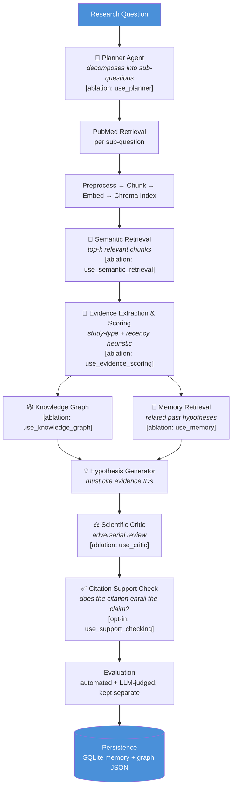

<div align="center">

# 🧬 BioGenesis

### A persistent, evidence-aware multi-agent biomedical research assistant

*Retrieves literature → extracts and scores evidence → builds a knowledge graph → generates and adversarially critiques hypotheses — with every design choice built to be measured, not just demoed.*

[](https://www.python.org/)
[](#-testing)
[](LICENSE)
[](#-why-0-cost)
[](#-experimental-status)

[Overview](#-overview) • [Architecture](#-architecture) • [Quickstart](#-quickstart) • [Research Framework](#-research-framework) • [Results](#-experimental-status) • [Limitations](#-known-limitations)

</div>

---

## 📌 TL;DR

> An evidence-aware multi-agent system for biomedical hypothesis generation, built and evaluated as a **research artifact**: 9 experimental configurations (3 baselines + 1 full system + 5 ablations) sharing one code path, 65 offline unit tests, a three-way metric split (automated / LLM-judged / human) that is never blended into a single misleading number, and zero fabricated results anywhere in the repo. Built entirely on free-tier infrastructure. A benchmark run and arXiv writeup are in progress — see [Experimental Status](#-experimental-status) for live numbers.

## 🔍 Overview

Most "chat with your papers" tools stop at retrieval-augmented generation: fetch a few chunks, stuff them in a prompt, hope the model doesn't hallucinate. BioGenesis was built to test a sharper, falsifiable question:

> **Can an evidence-aware multi-agent architecture measurably improve the grounding, traceability, contradiction-handling, and reliability of biomedical research synthesis compared to a plain LLM or standard RAG — and can that improvement be proven, not just claimed?**

Given a research question, BioGenesis:

1. **Plans** — decomposes it into sub-questions
2. **Retrieves** — pulls relevant literature from PubMed
3. **Grounds** — extracts structured, scored evidence claims and links them in a knowledge graph
4. **Generates** — proposes hypotheses that must cite specific evidence
5. **Critiques** — an adversarial agent reviews each hypothesis
6. **Verifies** — a separate pass checks whether each citation *actually* entails the claim it's attached to
7. **Remembers** — persists everything to local storage so future questions build on past reasoning

Every one of those seven steps is individually switchable, so the system's actual contribution can be isolated and measured — not assumed.

## 🏗️ Architecture



Every `[ablation: …]` tag is a constructor argument on `BioGenesisOrchestrator` — the full system and every ablation run through the **exact same code path**. There is no separate "demo version." This is what makes the results in [Section: Experimental Status](#-experimental-status) an actual comparison rather than an anecdote.

## 📁 Repository Layout

```
biogenesis/
├── src/biogenesis/
│   ├── config.py               # all settings, loaded from .env
│   ├── llm_client.py           # Groq API wrapper shared by every agent
│   ├── json_utils.py           # defensive JSON parsing/repair for LLM output
│   ├── retrieval/              # PubMed client
│   ├── preprocessing/          # cleaning + chunking
│   ├── embeddings/             # sentence-transformers (lazy-loaded)
│   ├── vectorstore/            # Chroma wrapper
│   ├── evidence/               # extraction, scoring, contradiction resolution,
│   │                           #   citation-support checking
│   ├── knowledge_graph/        # NetworkX graph builder
│   ├── agents/                 # Planner, Hypothesis Generator, Critic
│   ├── orchestration/          # wires all agents together + ablation flags
│   ├── evaluation/             # automated / LLM-judged / human metrics
│   └── memory/                 # persistent SQLite memory + retrieval
├── experiments/
│   ├── benchmark_schema.py     # benchmark item schema + loader
│   ├── benchmark.json          # example benchmark questions (no fabricated gold data)
│   ├── baselines.py            # LLM-only / standard RAG / evidence-aware RAG
│   ├── runner.py                # CLI: run any config against any benchmark
│   ├── configs/*.yaml           # 9 experiment configs (3 baselines + 6 ablations)
│   └── results/                 # JSONL output (gitignored)
├── pipeline.py                  # quick manual full-system run
├── tests/                       # 65 offline, fakes-based unit tests
├── docs/ARCHITECTURE.md         # design rationale for each component
├── data/                        # local vector DB + memory DB (gitignored)
├── .env.example
└── LICENSE
```

## ⚡ Quickstart

```bash
git clone https://github.com/Ayesha037/biogenesis.git
cd biogenesis
python3 -m venv .venv && source .venv/bin/activate
pip install -r requirements.txt && pip install -e .
cp .env.example .env    # then add your free GROQ_API_KEY — see below
```

| Variable | Where to get it | Required? |
|---|---|---|
| `GROQ_API_KEY` | [console.groq.com/keys](https://console.groq.com/keys) — free, no card | **Yes** |
| `NCBI_EMAIL` | Your email address | Recommended (NCBI usage policy) |
| `NCBI_API_KEY` | [ncbi.nlm.nih.gov/account](https://www.ncbi.nlm.nih.gov/account/) → API Key Management — free | Optional (3 → 10 req/sec) |

Everything else — vector DB, knowledge graph, memory — is local, free, and needs no account.

**Run the full system on one question:**

```bash
python pipeline.py "does metformin reduce cancer risk in diabetic patients"
```

This plans → retrieves → embeds → filters → extracts evidence → scores it → builds the knowledge graph → pulls in relevant memory → generates hypotheses → critiques them → checks citation support → evaluates → persists everything to `data/`. First run is slower while the embedding model downloads (~80MB, one time); every run after reuses the local index.

**Run the test suite** (no API key needed — everything's a fake):

```bash
pytest tests/
```

## 🔬 Research Framework

BioGenesis ships with a full experimental harness so its central claim can be tested, not asserted.

**Nine configurations, one benchmark, one comparable output schema:**

| Config | Type | Tests |
|---|---|---|
| `llm_only` | Baseline 1 | Floor — no retrieval at all |
| `standard_rag` | Baseline 2 | Raw chunk retrieval, no evidence structure |
| `evidence_aware_rag` | Baseline 3 | + evidence extraction/scoring, no Planner/Critic/KG |
| `full_biogenesis` | Full system | Everything on |
| `no_knowledge_graph` | Ablation | Full minus knowledge graph |
| `no_critic` | Ablation | Full minus critic |
| `no_evidence_scoring` | Ablation | Full minus evidence scoring |
| `no_planner` | Ablation | Full minus sub-question decomposition |
| `no_memory` | Ablation | Full minus memory-augmented reasoning |

Each ablation differs from `full_biogenesis.yaml` by **exactly one flag** — enforced by a dedicated test, so comparisons can't silently become confounded.

```bash
python experiments/runner.py --config full_biogenesis --benchmark experiments/benchmark.json
python experiments/runner.py --config standard_rag --benchmark experiments/benchmark.json
python experiments/runner.py --config full_biogenesis --benchmark experiments/benchmark.json --check-support
```

**Metrics are split into categories that are never blended:**

- **Automated** — citation validity, evidence coverage/diversity, contradiction rate, citation support rate. Deterministic.
- **LLM-judged** — Critic approval rate and verdict distribution. Explicitly labeled as model opinion, not ground truth.
- **Human** — an unrated template (`human_eval_schema()`) for a person to score. No rating is ever invented.
- **Retrieval** — precision/recall/nDCG@k, computed only when gold-relevant PMIDs exist for a benchmark item; otherwise reported as `None` with a note, never a fabricated zero.

## 📊 Experimental Status

*Live, updated as the free-tier Groq benchmark run progresses:*

| Configuration | Progress | Status |
|---|---:|:---:|
| LLM-only (baseline) | 40 / 40 | ✅ Complete |
| Standard RAG (baseline) | 40 / 40 | ✅ Complete |
| Evidence-aware RAG (baseline) | 22 / 40 | 🔄 In progress |
| Full BioGenesis | 0 / 40 | ⏳ Queued |

> **No comparative performance claim is made anywhere in this repository until the full benchmark completes.** Results and automated/LLM-judged metrics will be published here ahead of an arXiv submission.

**Verification performed so far:**

- ✅ 65/65 unit and integration tests passing, including a test that every ablation flag *actually disables* its component
- ✅ A real end-to-end attempt against live PubMed/Groq confirmed the runner fails *safely* — errors are captured as `status="error"` records with the real traceback, never silently swallowed or faked
- ✅ An offline structural run (fake LLM/PubMed responses) executed all 9 configs to confirm the runner, dispatch, ablation flags, and JSONL serialization work end-to-end

## ⚠️ Known Limitations

Stated plainly, because the point of the research framework is to not oversell results:

- Evidence extraction and hypothesis quality depend on the Groq-hosted model's reasoning — a free 70B-class model is good, not infallible. Outputs are a research **aid**, not ground truth.
- Evidence scoring is a transparent heuristic (study-type hierarchy + recency decay), not a learned/validated model.
- Entity resolution is naive: `"Metformin"` and `"metformin hydrochloride"` are currently distinct graph nodes. Real biomedical entity normalization (e.g. UMLS linking) is future work.
- Contradiction resolution *surfaces* conflicts; it does not adjudicate them.
- Memory retrieval is keyword-overlap based, not semantic.
- This is a **research prototype**, not a clinical decision-support tool.

## 🗺️ Roadmap

- [ ] Finish the `full_biogenesis` benchmark run
- [ ] Expand `experiments/benchmark.json` from 8 to 30–50 questions
- [ ] Source real gold relevance labels for retrieval metrics
- [ ] Run `--check-support` at scale for real citation-support numbers
- [ ] Conduct human evaluation using `human_eval_schema()`
- [ ] Add biomedical entity normalization (UMLS/MeSH linking)
- [ ] Swap to a biomedical-domain embedding model (e.g. PubMedBERT)
- [ ] Add full-text retrieval via the PMC Open Access subset
- [ ] Submit results paper to arXiv

## 💸 Why $0 Cost

| Component | Free tier used |
|---|---|
| LLM inference | Groq API |
| Literature retrieval | NCBI PubMed E-utilities |
| Embeddings | `sentence-transformers` (local, open-source) |
| Vector store | Chroma (local, open-source) |
| Knowledge graph | NetworkX (local, open-source) |
| Memory | SQLite (local) |

No paid plan, no credit card, anywhere in the stack — by design, so the system is reproducible by anyone.

## 📄 Citation

A results paper is in preparation for arXiv once the benchmark run completes.

```bibtex
@software{biogenesis2026,
  author = {Ayesha},
  title  = {BioGenesis: An Evidence-Aware Multi-Agent Biomedical Research Assistant},
  year   = {2026},
  url    = {https://github.com/Ayesha037/biogenesis}
}
```

## 📜 License

[MIT](LICENSE) — free to use, modify, and build on, with attribution.

---

<div align="center">

Built as a research artifact, one ablation flag at a time.

</div>
