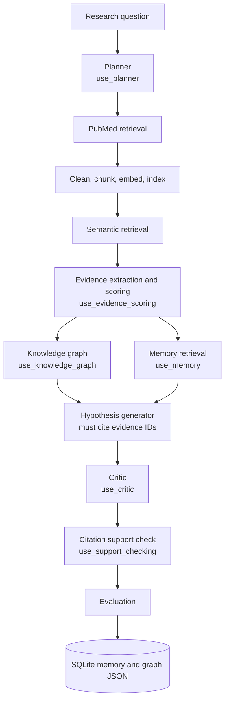

# BioGenesis

**An evidence-aware, multi-agent system for biomedical hypothesis generation, built so that every design choice can be measured.**

[](https://www.python.org/)
[](LICENSE)
[](#current-status)

> **Research prototype. Not a clinical decision-support tool.** Outputs are literature-grounded suggestions for researchers to verify, not medical advice.

---

## Why this project exists

Most "chat with papers" tools stop at retrieval-augmented generation: fetch a few text chunks, put them in a prompt, and trust the model not to hallucinate. BioGenesis asks a narrower, testable question:

> Does adding explicit evidence structure (scored claims, a knowledge graph, an adversarial critic, citation checking) measurably improve the grounding and reliability of biomedical hypotheses compared with a plain LLM or standard RAG?

To answer it, the project ships a pipeline **and** an evaluation harness: 9 configurations (3 baselines, the full system, 5 ablations) share one code path, a 40-question benchmark, and metrics that are reported separately and never blended into one score.

## What it does

Given a research question, for example *"What evidence exists that metformin reduces colorectal cancer risk in people with type 2 diabetes?"*, BioGenesis:

1. **Plans**: decomposes the question into sub-questions.
2. **Retrieves**: searches PubMed for each sub-question.
3. **Grounds**: chunks and embeds abstracts, then extracts structured evidence claims and scores them (study design hierarchy plus recency).
4. **Links**: builds a knowledge graph of entities and claims, and surfaces contradictions.
5. **Generates**: proposes hypotheses that must cite specific evidence items (PMIDs).
6. **Critiques**: an adversarial agent reviews each hypothesis.
7. **Verifies** (optional): checks whether each cited abstract actually supports the claim it is attached to.
8. **Remembers**: stores hypotheses in a local SQLite memory for later questions.

Every step in 1, 3, 4, 6 and 8 can be switched off with a single flag, so its contribution can be isolated.

## Architecture


```mermaid
flowchart TD
    Q[Research question] --> P[Planner<br/>use_planner]
    P --> R[PubMed retrieval]
    R --> E[Clean, chunk, embed, index]
    E --> S[Semantic retrieval]
    S --> EX[Evidence extraction and scoring<br/>use_evidence_scoring]
    EX --> KG[Knowledge graph<br/>use_knowledge_graph]
    EX --> MEM[Memory retrieval<br/>use_memory]
    KG --> HG[Hypothesis generator<br/>must cite evidence IDs]
    MEM --> HG
    HG --> C[Critic<br/>use_critic]
    C --> SC[Citation support check<br/>use_support_checking]
    SC --> EV[Evaluation]
    EV --> DB[(SQLite memory and graph JSON)]
```

The full system and every ablation run through the **same orchestrator**. There is no separate demo path. A test enforces that each ablation differs from `full_biogenesis` by exactly one flag.

## Experimental design

| Config | Role | What it tests |
|---|---|---|
| `llm_only` | Baseline | No retrieval |
| `standard_rag` | Baseline | Raw chunk retrieval, no evidence structure |
| `evidence_aware_rag` | Baseline | Adds evidence extraction and scoring |
| `full_biogenesis` | Full system | All components on |
| `no_planner` | Ablation | Removes sub-question decomposition |
| `no_evidence_scoring` | Ablation | Removes evidence scoring |
| `no_knowledge_graph` | Ablation | Removes the knowledge graph |
| `no_memory` | Ablation | Removes memory-augmented reasoning |
| `no_critic` | Ablation | Removes the adversarial critic |

**Benchmark.** 40 questions, 8 categories of 5: drug-disease outcome, treatment outcome, gene-disease, biomarker-disease, drug adverse event, mechanism, association/risk, and conflicting evidence (`experiments/benchmark.json`). The benchmark contains questions only; no gold answers were invented.

**Fixed settings.** Model `openai/gpt-oss-120b` via Groq, seed 42, PubMed via NCBI E-utilities, local `sentence-transformers` embeddings.

**Metrics, kept separate:**

- **Automated (deterministic):** citation validity (are cited PMIDs real and retrieved), evidence coverage and diversity, contradiction rate, citation support rate.
- **LLM-judged:** critic verdict distribution. This is model opinion, not ground truth.
- **Human:** a rating template (`human_eval_schema()`); no ratings are ever generated.
- **Retrieval:** precision, recall and nDCG@k, only when gold PMIDs exist; otherwise `None`, never a fake zero.

## Current status

*Last updated: [DATE]. Update this section after every run.*

| Config | Completed items (status ok) | Items with at least one hypothesis | Notes |
|---|---:|---:|---|
| `llm_only` | 40 / 40 | n/a | Answer-level judging not yet done |
| `standard_rag` | 40 / 40 | n/a | Answer-level judging not yet done |
| `evidence_aware_rag` | 40 / 40 | n/a | Free-tier rate limits required many retries |
| `full_biogenesis` | 40 / 40 | 27 / 40 | See preliminary metrics below |
| `no_planner` | 31 / 40 | 16 / 40 | Partial; 9 items outstanding |
| `no_evidence_scoring`, `no_knowledge_graph`, `no_memory`, `no_critic` | not yet run | | |

"Completed" means the pipeline returned without error. It does not mean the output was useful: some completed runs retrieved no papers or produced no hypotheses, which is why the second column is reported.

### Preliminary metrics (`full_biogenesis`, 27 questions with hypotheses)

| Metric | Value |
|---|---:|
| Citation validity | 1.00 |
| Citation support rate | 0.60 |
| Contradiction rate | 0.04 |
| Evidence items per question (mean) | 14.3 |

These numbers are **preliminary**. They come from runs spread across several code revisions and will be recomputed from a single final run. Critic approval is deliberately not headlined: most verdicts are "needs caveats", which the metric counts as approval, so it carries little information.

> No claim of superiority over the baselines is made until all configurations are re-run on the same code version and compared on the same set of questions.

## Quickstart

```bash
git clone https://github.com/Ayesha037/biogenesis.git
cd biogenesis
python3 -m venv .venv && source .venv/bin/activate
pip install -r requirements.txt && pip install -e .
cp .env.example .env     # then add your keys
```

| Variable | Source | Required |
|---|---|---|
| `GROQ_API_KEY` | [console.groq.com/keys](https://console.groq.com/keys) (free tier) | Yes |
| `NCBI_EMAIL` | Your email (NCBI usage policy) | Recommended |
| `NCBI_API_KEY` | [NCBI account settings](https://www.ncbi.nlm.nih.gov/account/) | Optional (raises rate limit) |

Never commit `.env`. It is gitignored, but also exclude it when zipping or sharing the project.

**Run one question:**

```bash
python pipeline.py "does metformin reduce cancer risk in diabetic patients"
```

The first run downloads the embedding model (about 80 MB, once).

**Run an experiment:**

```bash
python experiments/runner.py --config full_biogenesis --benchmark experiments/benchmark.json
python experiments/runner.py --config standard_rag --benchmark experiments/benchmark.json --limit 5
python experiments/runner.py --config full_biogenesis --benchmark experiments/benchmark.json --check-support
```

Results are written as JSONL to `experiments/results/`. Failures are stored as `status="error"` records with the traceback, never hidden or replaced with fake output.

**Run the tests** (no API key needed; all external calls are faked):

```bash
pytest tests/
```

## Repository layout

```
biogenesis/
├── src/biogenesis/
│   ├── retrieval/        PubMed client
│   ├── preprocessing/    cleaning and chunking
│   ├── embeddings/       sentence-transformers wrapper
│   ├── vectorstore/      Chroma wrapper
│   ├── evidence/         extraction, scoring, contradictions, support checking
│   ├── knowledge_graph/  NetworkX graph builder
│   ├── agents/           planner, hypothesis generator, critic
│   ├── orchestration/    pipeline wiring and ablation flags
│   ├── evaluation/       automated, LLM-judged and human metrics
│   └── memory/           SQLite memory and retrieval
├── experiments/          benchmark, 9 configs, baselines, runner
├── tests/                offline unit tests
├── docs/ARCHITECTURE.md  design rationale
└── pipeline.py           single-question entry point
```

## Known limitations

- **Free-tier infrastructure.** Rate limits caused many retries and some failed runs. Results are only as consistent as the final re-run.
- **Retrieval failures.** Some questions return no PubMed results, and without the planner the raw question is often a poor search query.
- **Heuristic evidence scoring.** Study-type hierarchy plus recency decay; not a validated model.
- **Naive entity resolution.** "Metformin" and "metformin hydrochloride" are separate graph nodes. Normalisation (UMLS/MeSH) is future work.
- **Contradictions are surfaced, not adjudicated.**
- **Memory is keyword-based and shared across questions in a run**, which can leak earlier hypotheses into later ones. The final comparison isolates memory per question.
- **LLM judging is not ground truth.** Human evaluation is still to be done.
- **Abstracts only.** No full-text retrieval.

## Roadmap

- [ ] Fix empty-hypothesis failure paths (generator JSON retry, planner-off search fallback)
- [ ] Re-run all configurations on one commit with per-question memory isolation
- [ ] Add an answer-level judge for the baselines and a human-rated subsample
- [ ] Paired comparison with bootstrap confidence intervals, plus per-category results
- [ ] Biomedical entity normalisation and a biomedical embedding model
- [ ] Short technical report (Zenodo / arXiv)

## Citation

```bibtex
@software{summaiyya2026biogenesis,
  author = {Mohammad Ayesha Summaiyya},
  title  = {BioGenesis: An Evidence-Aware Multi-Agent System for Biomedical Hypothesis Generation},
  year   = {2026},
  url    = {https://github.com/Ayesha037/biogenesis}
}
```

## License

MIT. See [LICENSE](LICENSE).
